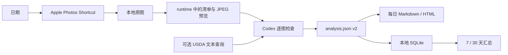

# Local HealthLog

Local HealthLog 是一套 macOS 本地优先的饮食记录流水线：Apple Shortcut 按日期导出照片，Codex 检查全部图片并生成带不确定区间和来源记录的 `analysis.json`，随后产出静态 Markdown/HTML、同步本地 SQLite，并通过统一健康门户切换补剂、每日饮食和 7/30 天汇总。



核心约束：原图不修改，私密数据不进 Git；照片只证明“可能吃了什么和多少”，营养组成来源单独记录；所有估算保留下界和上界，不把区间中点伪装成实测值。

## Clone 与初始化

要求：macOS、Python 3.10+、系统自带的 `shortcuts`。HEIC 预览优先使用 ImageMagick，未安装时回退到 macOS `sips`。运行时没有第三方 Python 依赖。

```bash
git clone <repository-url> local-healthlog
cd local-healthlog
./scripts/setup.sh --open-shortcut
```

脚本会：

- 从安全模板创建被忽略的 `config/health_profile.json`；
- 创建长期记录目录 `data/` 与可重建产物目录 `runtime/`；
- 可选安装 `diet` 与 Codex Skill 的用户级链接；
- 为当前 clone 的绝对路径构建并签名 Shortcut；
- 初始化私有 SQLite 并运行环境检查。

Apple 要求首次手工导入 Shortcut，并允许它读取 Photos。完成后编辑本地健康档案中的目标值。纯代码或 CI 式检查可以运行：

```bash
./scripts/setup.sh --no-install --skip-shortcut
```

## 每日分析

在 Codex 中说：

> 使用 `$daily-diet-pipeline` 分析昨天的饮食。

终端对应流程：

```bash
diet prepare yesterday
# Codex 检查全部预览并填写 analysis.json
diet render yesterday
diet verify yesterday
diet status yesterday
diet dashboard
```

`diet yesterday` 是 `diet prepare yesterday` 的缩写。Shortcut 只能直接写入 `data/daily/YYYYMMDD/`；CLI 会拒绝根目录别名或符号链接返回的路径。`render` 同时完成每日 Markdown/HTML、统一门户和 SQLite 同步；`verify` 会检查原图哈希、预览、schema、静态链接、报告、门户和数据库哈希。

本地入口是 `runtime/index.html`。它按“总览 → 健康计划 / 每日饮食 / 长期趋势 → 详细报告”分层，并在一个页面内切换健康与补剂、最近一天、全部日期、7 天和 30 天报告。页面不加载外部脚本、字体或图片；“单独打开”可脱离门户查看当前报告。

Schema v2 为每个食物条目分开记录：

- `evidence.portion_method`：称重、用户说明、包装份量、照片估份或未知；
- `evidence.nutrition_source`：包装标签、USDA FDC、配方估算、人工录入或未知；
- `nutrition`：热量、蛋白质、碳水、脂肪、纤维、钠的区间；
- `optional_nutrients`：仅保存标签或数据库实际支持的糖、钾、钙等，不把缺失值填成零。

## 可选 USDA FoodData Central

USDA 查询只发送食物文字或 FDC ID，不上传照片、健康档案或分析。默认优先 Foundation、SR Legacy 和 Survey/FNDDS；混合食堂菜继续使用配方宽区间。

Codex 自动决定是否查询时会遵守本地档案的 `privacy.allow_usda_text_queries`；直接运行以下 `fdc-*` 命令本身视为一次显式查询请求。

```bash
diet fdc-search "salmon cooked" --limit 5 --agent
diet fdc-food 171999 --grams 150:220 --agent
diet fdc-food 171999 --grams 150:220 --offline --agent
```

查询结果缓存在被忽略的 SQLite 中。没有 API key 时使用 USDA 的限流 `DEMO_KEY`；长期使用可在 shell 环境设置：

```bash
export FDC_API_KEY="your-data-gov-key"
```

不要把真实 key 写入配置或 `.env.example`。本项目也不会自动加载 `.env`。

## 7/30 天汇总

```bash
diet summary --days 7 --end today
diet summary --days 30 --end yesterday --agent
```

输出位于 `runtime/reports/nutrition/`，同时包含 JSON、Markdown 和无外部资源的静态 HTML。汇总会列出实际记录天数与缺失日期，只对有记录日期求平均，并分别处理区间上下界。少于 5 个有效日期时明确显示“数据不足”，不推断趋势。

如果手工复制或批量修改了旧记录：

```bash
diet rebuild-db
diet db-status
```

`analysis.json` 是可审阅的主记录；SQLite 是可重建索引，不是唯一数据源。

## 文件结构

```text
.
├── bin/diet                     # clone-local CLI
├── config/
│   ├── health_profile.example.json
│   └── health_profile.json      # 私密、忽略
├── data/                        # 长期私有记录、忽略
│   ├── daily/YYYYMMDD/          # 原始媒体 + canonical analysis.json
│   ├── medical/
│   └── supplements/
├── runtime/                     # 可删除重建的私有产物、忽略
│   ├── index.html               # 统一静态健康门户
│   ├── daily/YYYYMMDD/          # manifest、预览、每日 Markdown/HTML
│   ├── reports/nutrition/       # 7/30 天汇总
│   └── state/healthlog.sqlite3  # SQLite 索引与 USDA 缓存
├── src/healthlog/               # 流水线、SQLite、USDA 与汇总代码
├── tests/                       # 无个人数据的标准库测试
├── scripts/                     # 初始化、Shortcut 构建、隐私检查
├── skills/daily-diet-pipeline/  # 可安装 Codex Skill 与渐进式参考
├── build/                       # 生成物、忽略
└── docs/                        # 架构、隐私与上游设计审查
```

## 测试与隐私检查

```bash
PYTHONPATH=src python3 -m unittest discover -s tests -v
python3 scripts/check_privacy.py
```

Git 只应包含代码、文档、示例配置和 Skill。个人档案、照片、医疗记录、补剂记录、分析、报告、数据库、USDA 缓存、Shortcut 生成物和密钥都保留在本机。`data/` 是需要备份的私有事实层，`runtime/` 和 `build/` 都可重建；仓库根目录不保留 `daily` 等兼容链接。详见 [隐私边界](docs/privacy.md) 和 [架构](docs/architecture.md)。

本项目从现有营养 Skills 借鉴了接口思想，并独立实现了适合照片证据的来源模型；取舍与许可证见 [上游设计审查](docs/upstream-inspirations.md)。
