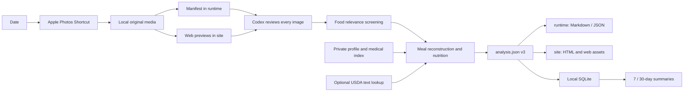

# Local HealthLog

**English** | [简体中文](README.zh-CN.md)

Local HealthLog is a local-first nutrition logging pipeline for macOS. An Apple
Shortcut exports photos for a requested date, Codex reviews every image and
creates a source-aware `analysis.json` with uncertainty intervals, and the
application renders static Markdown and HTML, updates a local SQLite index, and
combines a validated personal/medical profile, supplement guidance, daily
records, and 7/30-day summaries in one private health portal.



The core constraints are simple: original media is never modified, private data
never enters Git, photo evidence and nutrition-composition sources remain
separate, and every estimate preserves lower and upper bounds instead of
presenting a midpoint as a measurement.

Every exported asset is inspected before nutrition analysis. `consumed_food`
and `possible_food` form the food-related screening set, while only
`consumed_food` may link to a meal or contribute nutrients. Package-only food or
drink photos count as consumed when the local profile enables that rule;
`possible_food` waits for confirmation, and `unrelated` remains in a collapsed
audit section instead of cluttering the diet gallery.

## Clone and bootstrap

Requirements: macOS, Python 3.10 or later, and the built-in `shortcuts` command.
HEIC preview generation prefers ImageMagick and falls back to the macOS `sips`
tool. The runtime has no third-party Python dependencies.

```bash
git clone https://github.com/imathwy/health.git local-healthlog
cd local-healthlog
./scripts/setup.sh --open-shortcut
```

The setup script:

- creates the ignored operational `config/health_profile.json` from a safe
  template and initializes the active owner's durable personal profile;
- creates `data/` for durable records, `runtime/` for derived state, and `site/`
  for private browser output;
- optionally installs user-level links for the `diet` command and Codex Skill;
- builds and signs a clone-specific Shortcut containing the correct absolute
  paths;
- initializes the private SQLite database and runs environment diagnostics.

Apple requires the first Shortcut import to be performed manually and asks for
Photos access. After importing it, edit the `PROFILE_JSON` printed by setup and
run `diet profile` to validate and rebuild its private page.
For code-only or CI-style validation, run:

```bash
./scripts/setup.sh --no-install --skip-shortcut
```

## Personal profile and medical history

The workspace has one active local owner. Operational settings select its
stable `profile_id`; personal facts live in
`data/profiles/<profile_id>/profile.json`. Past records are indexed in
`medical/index.json`, and untouched PDFs or images live in `medical/files/`.

```bash
diet profile-init             # create missing private documents
diet profile                  # validate and rebuild profile HTML + dashboard
```

For an older schema-v1 workspace, `diet profile-init --migrate-config` preserves
a private legacy backup before removing personal facts from operational
settings. The generated `site/profile/index.html` shows structured body status,
conditions, symptoms, medicines, allergies, activity, targets, and a medical
timeline. It displays the count of raw records but never includes their names,
paths, or links. See the [personal profile boundary](docs/personal-profile.md).

## Daily analysis

In Codex, ask:

> Use `$daily-diet-pipeline` to analyze yesterday's diet.

The equivalent terminal workflow is:

```bash
diet prepare yesterday
# Codex reviews every preview, screens food relevance, and completes analysis.json
diet render yesterday
diet verify yesterday
diet status yesterday
diet dashboard
```

`diet yesterday` is shorthand for `diet prepare yesterday`. The Shortcut may
write only to `data/daily/YYYYMMDD/`; the CLI rejects root-level aliases and
paths returned through symlinks. `render` writes Markdown to `runtime/`, writes
HTML and browser assets to `site/`, and synchronizes the portal and SQLite.
`verify` checks original-media hashes, previews, the schema, static links,
directory boundaries, reports, the portal, and the database hash.

The local entry point is `site/index.html`. Its navigation follows “overview →
personal profile / health plan / daily diet / trends → detailed report” and
switches among the profile, supplement report, latest day, all dates, and
7/30-day summaries without leaving the portal. Every browser page and
display-only image stays under `site/`. Pages
load no external scripts, fonts, or images, and each report can also be opened
on its own.

Schema v3 continues to record separate evidence dimensions for every food item:

- `evidence.portion_method`: measured weight, user-provided serving, package
  serving, visual estimate, or unknown;
- `evidence.nutrition_source`: package label, USDA FDC, recipe estimate, manual
  entry, or unknown;
- `nutrition`: intervals for energy, protein, carbohydrate, fat, fiber, and
  sodium;
- `optional_nutrients`: sugar, potassium, calcium, and other values only when a
  label or database actually supports them; missing values are never stored as
  zero.

It also adds source-aware observations for direct drinking water, calcium,
sleep, caffeine, training duration/RPE, vegetables, fruit, body weight and
circumferences, and iron/calcium supplement timing. Per-meal protein is derived
from food items. Heme-iron and oily-fish frequency is counted from reviewed meal
tags. Unreported values remain `null`, and a partial photo log produces only a
confirmed minimum event count.

The example personal profile uses reference defaults such as 1,000 mg calcium for adults
age 19–50, 1,700 mL base direct drinking water for an adult man, and 20–40 g
protein per meal; local profiles can override them. Ordinary mixed meals are
not labeled an iron/calcium conflict. The timing field primarily checks a
separate iron supplement against a calcium supplement; follow the iron product
label or clinician guidance for high-calcium foods.
See [tracking metric definitions](docs/tracking-metrics.md).

## Optional USDA FoodData Central lookup

USDA requests send only food text or an FDC ID. They never upload photos, the
health profile, or an analysis. Foundation, SR Legacy, and Survey/FNDDS records
are preferred by default; mixed cafeteria dishes continue to use broad recipe
intervals.

When Codex decides whether to query automatically, it follows
`privacy.allow_usda_text_queries` in the local profile. Running an `fdc-*`
command directly is itself an explicit lookup request.

```bash
diet fdc-search "salmon cooked" --limit 5 --agent
diet fdc-food 171999 --grams 150:220 --agent
diet fdc-food 171999 --grams 150:220 --offline --agent
```

Responses are cached in the ignored SQLite database. Without an API key, the
client uses USDA's rate-limited `DEMO_KEY`. For regular use, set a key in the
shell environment:

```bash
export FDC_API_KEY="your-data-gov-key"
```

Never place a real key in configuration or `.env.example`. The application does
not load `.env` automatically.

## 7/30-day summaries

```bash
diet summary --days 7 --end today
diet summary --days 30 --end yesterday --agent
```

JSON and Markdown are written to `runtime/reports/nutrition/`; self-contained
static HTML is written to `site/nutrition/`. A summary reports logged and missing
dates, averages only the logged dates, and processes lower and upper interval
bounds separately. It also shows per-meal protein distribution, confirmed
heme-iron and oily-fish meal frequency, water/calcium/recovery coverage,
iron/calcium timing, and measured body changes. With fewer than five logged
dates it reports insufficient data instead of inferring an interval trend.

After copying or editing old records outside the normal workflow, run:

```bash
diet rebuild-db
diet db-status
```

`analysis.json` is the reviewable source of truth. SQLite is a rebuildable index,
not the only copy of the records.

## Repository layout

```text
.
├── bin/diet                     # Clone-local CLI
├── config/
│   ├── health_profile.example.json
│   ├── personal_profile.example.json
│   └── health_profile.json      # Private operational settings; ignored
├── data/                        # Durable private records; ignored
│   ├── daily/YYYYMMDD/          # Original media + canonical analysis.json
│   ├── profiles/<id>/
│   │   ├── profile.json         # Canonical personal and health context
│   │   └── medical/             # index.json + untouched files/
│   └── supplements/
├── runtime/                     # Rebuildable private output; ignored
│   ├── daily/YYYYMMDD/          # Manifest, template, daily Markdown
│   ├── profile/                 # Validated agent-facing profile snapshot
│   ├── reports/nutrition/       # 7/30-day JSON and Markdown
│   └── state/healthlog.sqlite3  # SQLite index and USDA cache
├── site/                        # Private browser presentation; ignored
│   ├── index.html               # Unified static health portal
│   ├── profile/                 # Personal status and medical timeline HTML
│   ├── health/                  # Health/supplement HTML and web assets
│   ├── daily/YYYYMMDD/          # Daily HTML and JPEG previews
│   └── nutrition/               # 7/30-day HTML
├── src/healthlog/               # Layered application code
│   ├── cli.py                   # Argument parsing and exit codes
│   ├── commands.py              # Use-case orchestration
│   ├── profile_workflow.py      # Profile migration/render orchestration
│   ├── analysis.py              # Analysis schema, validation, targets
│   ├── nutrition.py             # Nutrition vocabulary and interval aggregation
│   ├── tracking.py              # Water, calcium, recovery, body, and meal metrics
│   ├── tracking_summary.py      # Longitudinal tracking aggregation and coverage
│   ├── summary.py               # Longitudinal summary domain logic
│   ├── personal_profile.py      # Personal/medical schemas and validation
│   ├── workspace.py             # Config, path boundaries, atomic file I/O
│   ├── media.py                 # Shortcut, media manifest, previews
│   ├── presentation.py          # Markdown, HTML, local portal
│   ├── profile_presentation.py  # Private profile HTML adapter
│   ├── store.py                 # Rebuildable SQLite adapter
│   └── fdc.py                   # USDA FoodData Central adapter
├── tests/                       # Standard-library tests without personal data
├── scripts/                     # Setup, Shortcut build, privacy checks
├── skills/daily-diet-pipeline/  # Installable Codex Skill and references
├── build/                       # Generated and ignored
└── docs/                        # Architecture, privacy, upstream design review
```

## Tests and privacy checks

```bash
PYTHONPATH=src python3 -m unittest discover -s tests -v
python3 scripts/check_privacy.py
```

Git should contain only source code, documentation, example configuration, and
the Skill. The personal profile, photos, medical and supplement records,
analyses, reports, databases, USDA cache, generated Shortcut, and secrets remain
local. `data/` is the private source-of-truth layer that should be backed up;
`runtime/` is machine state; `site/` is the only browser-facing tree; and
`build/` contains developer output. The repository root keeps no compatibility
aliases such as `daily`. See the [privacy boundary](docs/privacy.md) and
[architecture](docs/architecture.md).

The project borrows interface ideas from existing nutrition Skills and
independently implements a provenance model suited to photo evidence. See the
[upstream design review](docs/upstream-inspirations.md) for trade-offs and
licenses.

Application dependencies flow in one direction: `cli → commands →
domain/adapters`. The `analysis`, `nutrition`, `tracking`, `tracking_summary`,
`personal_profile`, and `summary` domain modules do
not import filesystem, media, presentation, SQLite, or network adapters. See
the [architecture document](docs/architecture.md) for module ownership and the
dependency graph.

## License

Original code and documentation in this repository are available under the
[MIT License](LICENSE). Referenced upstream projects retain their own licenses;
none of their implementations are vendored here.
