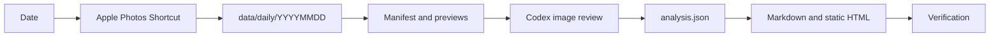

# Local HealthLog

Local HealthLog is a macOS-first, private Apple Photos workflow for dated food logging. It exports one day of photos through Apple Shortcuts, prepares reviewable JPEG previews, and lets Codex generate structured nutrition estimates, Markdown reports, and standalone HTML.



## Clone and set up

Requirements are macOS, Python 3.10 or newer, and the built-in `shortcuts` command. ImageMagick is preferred for HEIC previews; macOS `sips` is the fallback.

```bash
git clone <repository-url> local-healthlog
cd local-healthlog
./scripts/setup.sh --open-shortcut
```

The setup script:

- creates an ignored local profile from `config/health_profile.example.json`;
- creates the private `data/` directories;
- installs optional `diet` and Codex Skill links under the current user account;
- builds and signs a Shortcut whose destination is this clone’s `data/daily/` path;
- opens the Shortcut when `--open-shortcut` is supplied.

Apple requires one manual Shortcut import and Photos permission grant. After clicking **Add Shortcut** and allowing Photos access, the workflow is ready. Edit `config/health_profile.json` before relying on its nutrition targets.

For a code-only setup, such as a clean-clone test:

```bash
./scripts/setup.sh --no-install --skip-shortcut
```

## Daily use

In Codex:

> Use `$daily-diet-pipeline` to analyze yesterday’s food photos.

From the terminal:

```bash
diet doctor
diet prepare yesterday
diet render yesterday
diet verify yesterday
diet status yesterday
```

`diet yesterday` is shorthand for `diet prepare yesterday`. Preparation runs the Shortcut unless `--skip-export` is explicitly supplied.

## Repository layout

```text
.
├── bin/                         # clone-local command entrypoints
│   └── diet
├── config/
│   ├── health_profile.example.json  # safe tracked template
│   └── health_profile.json          # private, ignored
├── data/                        # all private health data, ignored
│   ├── daily/
│   ├── medical/
│   └── supplements/
├── src/healthlog/               # report pipeline implementation
├── scripts/
│   ├── setup.sh
│   ├── build_shortcut.py
│   └── check_privacy.py
├── skills/daily-diet-pipeline/  # portable Codex Skill
├── build/                       # generated Shortcut and caches, ignored
├── docs/                        # architecture and privacy documentation
└── .githooks/pre-commit         # staged-content privacy gate
```

Raw media is never modified or deleted by the pipeline. The food-photo convention is configured in the local profile. With the default setting, a dated food or drink photo means some amount was consumed, while the consumed quantity can remain uncertain. Repeated angles count once.

## Privacy model

Only source code, documentation, the example profile, and the Skill belong in Git. These remain local:

- personal profile and nutrition targets;
- exported photos, medical records, supplement records, analyses, and reports;
- generated previews, Shortcut XML, and signed `.shortcut` files;
- environment files, caches, and editor state.

Run the same privacy gate used by the pre-commit hook at any time:

```bash
python3 scripts/check_privacy.py
```

See [`docs/privacy.md`](docs/privacy.md) for the exact boundary and recovery rules.

## Rebuild the Shortcut

The builder derives the destination from the current clone instead of embedding a developer path:

```bash
python3 scripts/build_shortcut.py --sign
plutil -lint build/shortcuts/daily_photos_cli.xml
open "build/shortcuts/导出每日照片 CLI.shortcut"
```

Generated artifacts stay in `build/` and are never committed. The installed Shortcut receives `YYYY-MM-DD`, `today`, or `yesterday` through standard input and does not display date or save-location dialogs.
