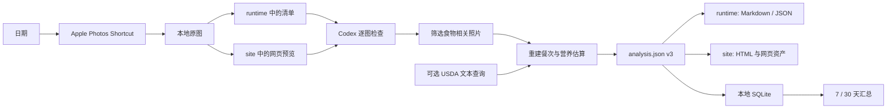

# Local HealthLog

**简体中文** | [English](README.md)

Local HealthLog 是一套 macOS 本地优先的饮食记录流水线：Apple Shortcut 按日期导出照片，Codex 检查全部图片并生成带不确定区间和来源记录的 `analysis.json`，随后产出静态 Markdown/HTML、同步本地 SQLite，并通过统一健康门户切换补剂、每日饮食和 7/30 天汇总。



核心约束：原图不修改，私密数据不进 Git；照片只证明“可能吃了什么和多少”，营养组成来源单独记录；所有估算保留下界和上界，不把区间中点伪装成实测值。

营养分析前会逐张检查当天导出的全部照片。`consumed_food` 与 `possible_food` 组成食物相关筛选集，但只有 `consumed_food` 可以关联餐次并进入营养合计。本地档案开启“食物照片表示有摄入”后，只有包装的食物或饮料照片也算确认摄入；`possible_food` 等待确认，`unrelated` 仅保留在默认折叠的审计区，不干扰饮食照片展示。

## Clone 与初始化

要求：macOS、Python 3.10+、系统自带的 `shortcuts`。HEIC 预览优先使用 ImageMagick，未安装时回退到 macOS `sips`。运行时没有第三方 Python 依赖。

```bash
git clone https://github.com/imathwy/health.git local-healthlog
cd local-healthlog
./scripts/setup.sh --open-shortcut
```

脚本会：

- 从安全模板创建被忽略的 `config/health_profile.json`；
- 创建长期记录目录 `data/`、机器运行目录 `runtime/` 与网页展示目录 `site/`；
- 可选安装 `diet` 与 Codex Skill 的用户级链接；
- 为当前 clone 的绝对路径构建并签名 Shortcut；
- 初始化私有 SQLite 并运行环境检查。

Apple 要求首次手工导入 Shortcut，并允许它读取 Photos。完成后编辑本地健康档案中的目标值。纯代码或 CI 式检查可以运行：

```bash
./scripts/setup.sh --no-install --skip-shortcut
```

## 每日分析

在 Codex 中说：

> 使用 `$daily-diet-pipeline` 分析昨天的饮食。

终端对应流程：

```bash
diet prepare yesterday
# Codex 检查全部预览、筛选食物相关照片并填写 analysis.json
diet render yesterday
diet verify yesterday
diet status yesterday
diet dashboard
```

`diet yesterday` 是 `diet prepare yesterday` 的缩写。Shortcut 只能直接写入 `data/daily/YYYYMMDD/`；CLI 会拒绝根目录别名或符号链接返回的路径。`render` 将 Markdown 写入 `runtime/`、HTML 与网页图片写入 `site/`，并同步统一门户和 SQLite；`verify` 会检查原图哈希、预览、schema、静态链接、目录边界、报告、门户和数据库哈希。

本地入口是 `site/index.html`。它按“总览 → 健康计划 / 每日饮食 / 长期趋势 → 详细报告”分层，并在一个页面内切换健康与补剂、最近一天、全部日期、7 天和 30 天报告。所有浏览器页面及其专用图片集中在 `site/`；页面不加载外部脚本、字体或图片，“单独打开”可脱离门户查看当前报告。

Schema v3 继续为每个食物条目分开记录：

- `evidence.portion_method`：称重、用户说明、包装份量、照片估份或未知；
- `evidence.nutrition_source`：包装标签、USDA FDC、配方估算、人工录入或未知；
- `nutrition`：热量、蛋白质、碳水、脂肪、纤维、钠的区间；
- `optional_nutrients`：仅保存标签或数据库实际支持的糖、钾、钙等，不把缺失值填成零。

它还增加一组有明确证据边界的执行指标：每日直接饮水量、钙摄入、睡眠、咖啡因、训练时长/RPE、蔬菜水果、体重与围度，以及铁/钙补剂时序。每餐蛋白质直接从食物条目汇总；血红素铁和油性鱼按已复核餐次计数。未提供的数据保持 `null`，照片覆盖不完整时频次只是确认下限。

公开模板给 19–50 岁成人设置 1,000 mg 钙、成年男性基础直接饮水 1,700 mL、每餐蛋白质 20–40 g 等参考值；本地档案可覆盖。普通混合膳食不会被标成“铁钙冲突”，主要检查单独铁剂是否与钙剂同服；高钙食物是否需要错开则按铁剂标签或医生要求。指标定义、测量条件和依据见 [追踪指标规则](docs/tracking-metrics.md)。

## 可选 USDA FoodData Central

USDA 查询只发送食物文字或 FDC ID，不上传照片、健康档案或分析。默认优先 Foundation、SR Legacy 和 Survey/FNDDS；混合食堂菜继续使用配方宽区间。

Codex 自动决定是否查询时会遵守本地档案的 `privacy.allow_usda_text_queries`；直接运行以下 `fdc-*` 命令本身视为一次显式查询请求。

```bash
diet fdc-search "salmon cooked" --limit 5 --agent
diet fdc-food 171999 --grams 150:220 --agent
diet fdc-food 171999 --grams 150:220 --offline --agent
```

查询结果缓存在被忽略的 SQLite 中。没有 API key 时使用 USDA 的限流 `DEMO_KEY`；长期使用可在 shell 环境设置：

```bash
export FDC_API_KEY="your-data-gov-key"
```

不要把真实 key 写入配置或 `.env.example`。本项目也不会自动加载 `.env`。

## 7/30 天汇总

```bash
diet summary --days 7 --end today
diet summary --days 30 --end yesterday --agent
```

JSON 与 Markdown 位于 `runtime/reports/nutrition/`，无外部资源的静态 HTML 位于 `site/nutrition/`。汇总会列出实际记录天数与缺失日期，只对有记录日期求平均，并分别处理区间上下界。它同时展示每餐蛋白质分布、血红素铁与油性鱼的确认频次、饮水/钙/恢复指标覆盖、铁钙时序，以及体重和围度差值。少于 5 个有效日期时明确显示“数据不足”，不推断区间趋势。

如果手工复制或批量修改了旧记录：

```bash
diet rebuild-db
diet db-status
```

`analysis.json` 是可审阅的主记录；SQLite 是可重建索引，不是唯一数据源。

## 文件结构

```text
.
├── bin/diet                     # clone-local CLI
├── config/
│   ├── health_profile.example.json
│   └── health_profile.json      # 私密、忽略
├── data/                        # 长期私有记录、忽略
│   ├── daily/YYYYMMDD/          # 原始媒体 + canonical analysis.json
│   ├── medical/
│   └── supplements/
├── runtime/                     # 可删除重建的私有产物、忽略
│   ├── daily/YYYYMMDD/          # manifest、分析模板、每日 Markdown
│   ├── reports/nutrition/       # 7/30 天 JSON 与 Markdown
│   └── state/healthlog.sqlite3  # SQLite 索引与 USDA 缓存
├── site/                        # 私有网页展示层、忽略
│   ├── index.html               # 统一静态健康门户
│   ├── health/                  # 健康与补剂 HTML、网页资产
│   ├── daily/YYYYMMDD/          # 每日 HTML 与 JPEG 预览
│   └── nutrition/               # 7/30 天 HTML
├── src/healthlog/               # 分层应用代码
│   ├── cli.py                   # 参数解析与退出码
│   ├── commands.py              # 用例编排
│   ├── analysis.py              # 分析 schema、验证与目标比较
│   ├── nutrition.py             # 营养领域词汇与区间聚合
│   ├── tracking.py              # 饮水、钙、恢复、体测与餐次派生指标
│   ├── tracking_summary.py      # 扩展指标的长期聚合与覆盖规则
│   ├── summary.py               # 长期汇总领域逻辑
│   ├── workspace.py             # 配置、路径边界与原子文件 I/O
│   ├── media.py                 # Shortcut、媒体清单与预览
│   ├── presentation.py          # Markdown、HTML 与本地门户
│   ├── store.py                 # 可重建 SQLite 适配器
│   └── fdc.py                   # USDA FoodData Central 适配器
├── tests/                       # 无个人数据的标准库测试
├── scripts/                     # 初始化、Shortcut 构建、隐私检查
├── skills/daily-diet-pipeline/  # 可安装 Codex Skill 与渐进式参考
├── build/                       # 生成物、忽略
└── docs/                        # 架构、隐私与上游设计审查
```

## 测试与隐私检查

```bash
PYTHONPATH=src python3 -m unittest discover -s tests -v
python3 scripts/check_privacy.py
```

Git 只应包含代码、文档、示例配置和 Skill。个人档案、照片、医疗记录、补剂记录、分析、报告、数据库、USDA 缓存、Shortcut 生成物和密钥都保留在本机。`data/` 是需要备份的私有事实层，`runtime/` 是机器运行层，`site/` 是唯一网页展示层，`build/` 是开发生成层；仓库根目录不保留 `daily` 等兼容链接。详见 [隐私边界](docs/privacy.md) 和 [架构](docs/architecture.md)。

本项目从现有营养 Skills 借鉴了接口思想，并独立实现了适合照片证据的来源模型；取舍与许可证见 [上游设计审查](docs/upstream-inspirations.md)。

应用代码遵循单向依赖：`cli → commands → domain/adapters`，领域模块
`analysis / nutrition / tracking / tracking_summary / summary` 不反向导入文件系统、媒体、网页、SQLite
或网络适配器。具体职责和依赖图见 [架构](docs/architecture.md)。

## 许可证

本仓库的原创代码和文档采用 [MIT 许可证](LICENSE)。文中引用的上游项目仍适用
各自的许可证；本仓库没有打包或复制它们的实现。
