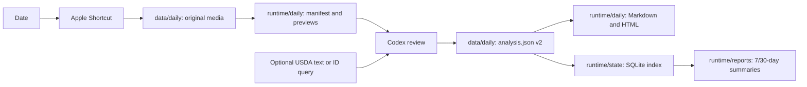

# Architecture

The repository has five explicit boundaries:

1. **Tracked application** — `src/healthlog/` owns date resolution, Shortcut
   execution, media manifests, previews, schema validation, source-aware
   nutrition records, report rendering, SQLite indexing, USDA normalization,
   summaries, and verification.
2. **Platform bridge** — `scripts/build_shortcut.py` creates a clone-specific
   Apple Shortcut. Python does not request Photos access; the Shortcut owns that
   permission and writes directly into `data/daily/`.
3. **Durable private records** — `data/daily/YYYYMMDD/` contains unmodified media
   and the human-reviewed `analysis.json`. `data/medical/` and
   `data/supplements/` hold the other user-owned health records. Back up this
   layer.
4. **Rebuildable private runtime** — `runtime/` contains manifests, previews,
   rendered daily reports, longitudinal reports, SQLite indexes, and the USDA
   cache. It can be removed and recreated from `data/` plus the local profile.
5. **Developer build output** — `build/` contains signed Shortcut artifacts and
   temporary test/build output. It is never a data source.

The two uncertainties in each item stay separate: `portion_method` explains how
consumed quantity was inferred, while `nutrition_source` explains where
composition values came from. This prevents a database match from implying that
the photographed portion was measured.

The Shortcut's returned `EXPORT_DIR` must exactly match the configured dated
record directory. The CLI deliberately rejects root aliases such as `daily/`,
even if a symlink would resolve to the same target. This keeps ownership visible
and prevents compatibility paths from becoming permanent API surface.

`bin/diet` resolves the repository from its own location, so it works both from
the clone and through a symlink in `~/.local/bin`. `HEALTHLOG_ROOT` may override
root discovery for isolated tests.

The Shortcut builder places absolute paths only in ignored build artifacts. No
tracked file should contain a user home path.
