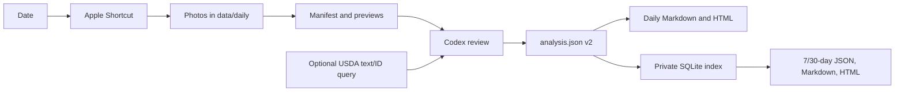

# Architecture

The repository has four boundaries:

1. **Tracked application** — `src/healthlog/` owns date resolution, Shortcut execution, media manifests, previews, schema validation, source-aware nutrition records, report rendering, SQLite indexing, USDA normalization, summaries, and verification.
2. **Platform bridge** — `scripts/build_shortcut.py` creates a clone-specific Apple Shortcut. Python does not request Photos access; the Shortcut owns that permission and writes into `data/daily/`.
3. **Canonical private records** — dated media, manifests, and `analysis.json` live below `data/daily/`. The schema-v2 analysis remains human-reviewable and is the source of truth.
4. **Derived private state** — `data/state/healthlog.sqlite3` indexes daily records and caches optional USDA responses. It can be deleted and rebuilt from valid dated analyses with `diet rebuild-db`.

The two uncertainties in each item stay separate: `portion_method` explains how consumed quantity was inferred, while `nutrition_source` explains where composition values came from. This prevents a database match from implying that the photographed portion was measured.

`bin/diet` resolves the repository from its own location, so it works both from the clone and through a symlink in `~/.local/bin`. `HEALTHLOG_ROOT` may override root discovery for isolated tests.

The Shortcut builder places absolute paths only in ignored build artifacts. No tracked file should contain a user home path.
