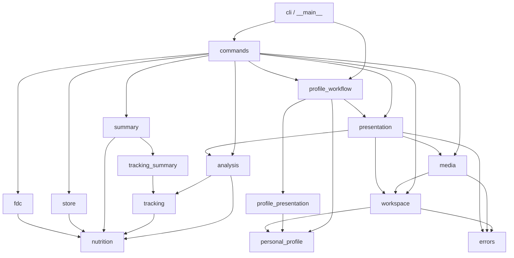
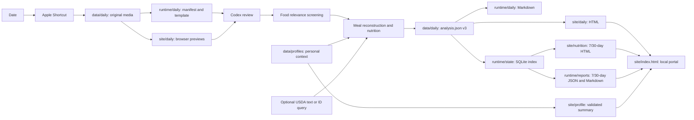

# Architecture

The repository has six explicit boundaries:

1. **Tracked application** — `src/healthlog/` separates its CLI adapter,
   application orchestration, nutrition domain, and external adapters. The
   module map below defines ownership and import direction.
2. **Platform bridge** — `scripts/build_shortcut.py` creates a clone-specific
   Apple Shortcut. Python does not request Photos access; the Shortcut owns that
   permission and writes directly into `data/daily/`.
3. **Durable private records** — `data/daily/YYYYMMDD/` contains unmodified media
   and the human-reviewed `analysis.json`.
   `data/profiles/<profile_id>/profile.json` is the personal source of truth;
   its `medical/index.json` describes untouched originals under
   `medical/files/`. `data/supplements/` holds the remaining user-owned health
   records. Back up this layer.
4. **Rebuildable private runtime** — `runtime/` contains manifests, analysis
   templates, Markdown/JSON reports, SQLite indexes, and the USDA cache. It can
   be removed and recreated from `data/` plus the local profile.
5. **Private presentation layer** — `site/` is the only browser-facing tree. It
   contains the portal, generated profile summary, health/supplement page, daily
   HTML, JPEG previews, and longitudinal HTML. Dated/profile outputs are
   rebuildable; locally authored health presentation files should be backed up.
6. **Developer build output** — `build/` contains signed Shortcut artifacts and
   temporary test/build output. It is never a data source.

## Application module boundaries

| Layer | Modules | Ownership |
|---|---|---|
| Entry adapter | `cli`, `__main__` | Parse arguments, route commands, translate expected failures to exit codes |
| Application | `commands`, `profile_workflow` | Orchestrate dated and personal-profile workflows; compose ports/adapters |
| Domain | `analysis`, `nutrition`, `tracking`, `tracking_summary`, `personal_profile`, `summary` | Analysis and personal/medical schemas, nutrient vocabulary, interval math, daily observations, meal-derived metrics, validation, target comparison, longitudinal summaries |
| External adapters | `workspace`, `media`, `presentation`, `profile_presentation`, `store`, `fdc` | Filesystem/config, Shortcuts and previews, daily/portal HTML, personal-profile HTML, SQLite, USDA HTTP |
| Foundation | `errors` | Stable application error shared by inward and outward layers |

The domain modules have no outward adapter imports. `tests/test_boundaries.py`
enforces that rule and also checks that private roots do not overlap or escape
through rendered assets. `WorkspacePaths`, `RenderedEntry`, and `DashboardView`
replace string-keyed path and view dictionaries where ownership matters. Large
HTML templates remain cohesive rendering functions because splitting static
markup into many tiny helpers would obscure rather than improve the boundary.

`config/health_profile.json` is an operational selector despite its legacy
filename. Schema v2 keeps the active profile ID, privacy switch, Shortcut name,
and roots there. `workspace.load_profile()` validates and projects the canonical
durable profile into the existing analysis context, so daily code has one source
for demographics, targets, diet context, and health guardrails. Schema-v1 files
remain readable long enough to run the explicit migration.

The two uncertainties in each item stay separate: `portion_method` explains how
consumed quantity was inferred, while `nutrition_source` explains where
composition values came from. This prevents a database match from implying that
the photographed portion was measured.

Schema v3 keeps photo-derived meal evidence and non-photo observations in one
dated, reviewable record without confusing their provenance. `tracking.py` owns
the vocabulary and validation for direct water, calcium, recovery, training,
body measurements, iron/calcium timing, and meal tags. Per-meal protein and
weekly event frequencies are projections; they are never duplicated as manual
facts. SQLite stores an effective tracking snapshot and meal nutrient totals,
while the original `analysis.json` remains canonical.

The Shortcut's returned `EXPORT_DIR` must exactly match the configured dated
record directory. The CLI deliberately rejects root aliases such as `daily/`,
even if a symlink would resolve to the same target. This keeps ownership visible
and prevents compatibility paths from becoming permanent API surface.

`bin/diet` resolves the repository from its own location, so it works both from
the clone and through a symlink in `~/.local/bin`. `HEALTHLOG_ROOT` may override
root discovery for isolated tests.

The Shortcut builder places absolute paths only in ignored build artifacts. No
tracked file should contain a user home path.
