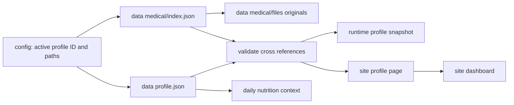

# Personal profile boundary

Local HealthLog has one **active local owner** per workspace. This is a private
desktop workflow, not an account system or a multi-tenant medical application.
The stable `active_profile_id` binds health context to that owner. Use a separate
clone/workspace for another person; the dated photo tree and SQLite index are
not designed for concurrent users or casual profile switching.

## Four separate responsibilities

| Layer | Path | Owns | Backup |
|---|---|---|---|
| Operational settings | `config/health_profile.json` | Active ID, Shortcut name, private roots, network privacy switch | Optional |
| Personal source of truth | `data/profiles/<id>/profile.json` | Demographics, body baseline, goals, activity, targets, diet context, current health status and guardrails | Yes |
| Medical source of truth | `data/profiles/<id>/medical/` | Searchable `index.json` plus untouched originals in `files/` | Yes |
| Generated projection | `runtime/profile/` and `site/profile/` | Agent snapshot and static browser page | Rebuildable |

Operational settings are intentionally boring. Personal facts do not belong
there because changing a directory or rebuilding a Shortcut must not create a
second, conflicting health history.



## Commands

```bash
# Create missing private documents; never overwrite existing facts.
diet profile-init

# Migrate a schema-v1 mixed config. The old document is preserved privately.
diet profile-init --migrate-config

# Validate the profile and medical index, then rebuild the page and portal.
diet profile
```

After initialization, edit the path printed as `PROFILE_JSON`. Put original
medical PDFs or images in the printed `MEDICAL_FILES_DIR`, then add a metadata
record to `MEDICAL_INDEX`. Each source records its path, lowercase SHA-256, and
media type. The path is relative to the medical directory and must start with
`files/`; absolute paths, `..`, symlink escapes, and digest changes are rejected.

Conditions and symptoms use stable IDs and may cite medical record IDs through
`record_ids`. This keeps three claims distinct:

1. the user reported a symptom;
2. a historical document recorded a finding;
3. a clinician made or currently maintains a diagnosis.

The schema does not convert one claim into another. Empty medicine and allergy
lists mean “not registered” unless an explicit note says that none were
confirmed.

## Browser privacy

`site/profile/index.html` shows structured summaries and how many originals are
registered. It never includes an original filename, filesystem path, image, PDF,
or clickable record link. The dashboard embeds only that generated summary.
Serve only `site/` on loopback if a local HTTP server is needed.

The runtime snapshot contains the structured private data so Codex can consume a
single validated projection. Both runtime and site are ignored by Git. Deleting
either does not remove the canonical profile or medical records; rerun
`diet profile` to recreate them.

## Migration and recovery

For schema-v1 workspaces, `--migrate-config` writes the canonical profile and an
empty medical index first, stores the old mixed document under the active
profile's `migrations/`, and only then rewrites operational settings. Existing
profile or medical files are never replaced.

When relocating a raw medical file, compare its cryptographic hash before and
after the move. Register the new `files/...` path, run `diet profile`, and keep
the old directory only if it still owns other records. The generated HTML is
never a backup.
